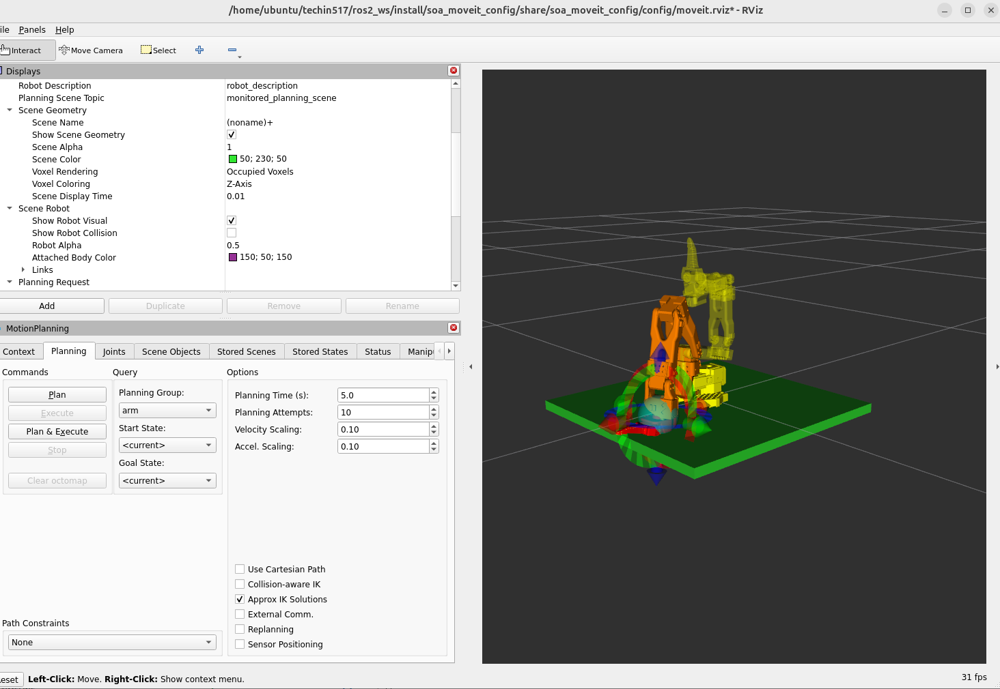

# Lab 4 Report: Pose Goals & Obstacle Avoidance - Alan Nur

## Deliverable 1: `move_to_pose_server` Code

```python
#!/usr/bin/env python3
"""
MoveToPose action server for the SOA 5-DOF arm.
Uses pymoveit2 to plan and execute IK-based motion to a target pose.
Implements a fallback strategy:
  1. Full pose (position + orientation)
  2. Relaxed orientation
  3. Position-only IK
"""

import math
import time

import rclpy
from rclpy.action import ActionServer
from rclpy.callback_groups import ReentrantCallbackGroup
from rclpy.executors import MultiThreadedExecutor
from rclpy.node import Node

from pymoveit2 import MoveIt2, MoveIt2State

from soa_interfaces.action import MoveToPose
from soa_functions import soa_robot


class MoveToPoseServer(Node):

    def __init__(self):
        super().__init__('move_to_pose_server')

        self.declare_parameter('max_velocity', 0.5)
        self.declare_parameter('max_acceleration', 0.5)
        self.declare_parameter('tolerance_position', 0.01)
        self.declare_parameter('tolerance_orientation', 0.1)
        self.declare_parameter('tolerance_orientation_relaxed', 0.5)
        self.declare_parameter('num_planning_attempts', 5)
        self.declare_parameter('allowed_planning_time', 3.0)
        self.declare_parameter('max_reach', 0.4)

        self._cb_group = ReentrantCallbackGroup()

        self._moveit2 = MoveIt2(
            node=self,
            joint_names=soa_robot.joint_names(),
            base_link_name=soa_robot.base_link_name(),
            end_effector_name=soa_robot.end_effector_name(),
            group_name=soa_robot.MOVE_GROUP_ARM,
            callback_group=self._cb_group,
        )

        self._moveit2.max_velocity = (
            self.get_parameter('max_velocity').get_parameter_value().double_value
        )
        self._moveit2.max_acceleration = (
            self.get_parameter('max_acceleration').get_parameter_value().double_value
        )
        self._moveit2.num_planning_attempts = (
            self.get_parameter('num_planning_attempts').get_parameter_value().integer_value
        )
        self._moveit2.allowed_planning_time = (
            self.get_parameter('allowed_planning_time').get_parameter_value().double_value
        )

        self._action_server = ActionServer(
            self,
            MoveToPose,
            'move_to_pose',
            self._execute_callback,
            callback_group=self._cb_group,
        )

        self.get_logger().info('MoveToPose action server ready')

    def _wait_and_publish_feedback(self, goal_handle, target_position):
        while self._moveit2.query_state() != MoveIt2State.IDLE:
            self._publish_feedback(goal_handle, target_position)
            time.sleep(0.1)
        self._publish_feedback(goal_handle, target_position)
        return self._moveit2.motion_suceeded

    def _plan_and_execute(self, goal_handle, position, quat_xyzw=None,
                          tol_pos=0.01, tol_orient=0.1, planning_time=None) -> bool:
        base_time = (
            self.get_parameter('allowed_planning_time').get_parameter_value().double_value
        )
        self._moveit2.allowed_planning_time = (
            planning_time if planning_time is not None else base_time
        )
        self._moveit2.clear_goal_constraints()

        kwargs = dict(
            position=position,
            tolerance_position=tol_pos,
            start_joint_state=self._moveit2.joint_state,
        )
        if quat_xyzw is not None:
            kwargs['quat_xyzw'] = quat_xyzw
            kwargs['tolerance_orientation'] = tol_orient

        future = self._moveit2.plan_async(**kwargs)
        if future is None:
            return False

        while not future.done():
            time.sleep(0.1)

        trajectory = self._moveit2.get_trajectory(future)
        if trajectory is None:
            return False

        self._moveit2.execute(trajectory)
        return self._wait_and_publish_feedback(goal_handle, position)

    def _execute_callback(self, goal_handle):
        self.get_logger().info('Received MoveToPose goal')

        tol_pos = self.get_parameter('tolerance_position').get_parameter_value().double_value
        tol_orient = self.get_parameter('tolerance_orientation').get_parameter_value().double_value
        tol_orient_relaxed = self.get_parameter('tolerance_orientation_relaxed').get_parameter_value().double_value
        planning_time = self.get_parameter('allowed_planning_time').get_parameter_value().double_value
        max_reach = self.get_parameter('max_reach').get_parameter_value().double_value

        target_pose = goal_handle.request.target_pose
        position = [target_pose.position.x, target_pose.position.y, target_pose.position.z]
        quat_xyzw = [target_pose.orientation.x, target_pose.orientation.y,
                     target_pose.orientation.z, target_pose.orientation.w]

        result = MoveToPose.Result()

        dist = math.sqrt(sum(p ** 2 for p in position))
        if dist > max_reach:
            goal_handle.abort()
            result.success = False
            result.message = f'Target distance {dist:.3f}m exceeds max reach {max_reach:.3f}m'
            self.get_logger().warn(result.message)
            return result

        quat_norm = math.sqrt(sum(q ** 2 for q in quat_xyzw))
        if abs(quat_norm - 1.0) > 0.01:
            goal_handle.abort()
            result.success = False
            result.message = f'Invalid quaternion norm: {quat_norm:.4f} (expected ~1.0)'
            self.get_logger().warn(result.message)
            return result

        attempts = [
            ('Attempt 1: full pose (tight)', quat_xyzw, tol_pos, tol_orient, planning_time),
            ('Attempt 2: full pose (relaxed orientation)', quat_xyzw, tol_pos, tol_orient_relaxed, planning_time),
            ('Attempt 3: position-only', None, tol_pos * 2, None, planning_time + 2.0),
        ]
        success_messages = [
            'Reached target: full pose (tight)',
            'Reached target: full pose (relaxed orientation)',
            'Reached target: position-only IK (orientation ignored)',
        ]

        for i, (label, quaternion, tolerance_position, tolerance_orientation, plan_time) in enumerate(attempts):
            self.get_logger().info(label)
            success = self._plan_and_execute(
                goal_handle, position=position, quat_xyzw=quaternion,
                tol_pos=tolerance_position,
                tol_orient=tolerance_orientation if tolerance_orientation is not None else tol_orient,
                planning_time=plan_time,
            )
            if success:
                goal_handle.succeed()
                result.success = True
                result.message = success_messages[i]
                self.get_logger().info(result.message)
                return result
            self.get_logger().warn(f'{label} — failed')

        goal_handle.abort()
        result.success = False
        result.message = 'All planning attempts failed'
        self.get_logger().error(result.message)
        return result

    def _publish_feedback(self, goal_handle, target_position):
        feedback = MoveToPose.Feedback()
        try:
            fk_future = self._moveit2.compute_fk_async()
            if fk_future is not None:
                while not fk_future.done():
                    time.sleep(0.1)
                fk_result = self._moveit2.get_compute_fk_result(fk_future)
            else:
                fk_result = None
            if fk_result is not None:
                current = fk_result.pose.position
                dx = current.x - target_position[0]
                dy = current.y - target_position[1]
                dz = current.z - target_position[2]
                feedback.distance_to_goal = math.sqrt(dx**2 + dy**2 + dz**2)
            else:
                feedback.distance_to_goal = -1.0
        except Exception:
            feedback.distance_to_goal = -1.0
        goal_handle.publish_feedback(feedback)


def main(args=None):
    rclpy.init(args=args)
    node = MoveToPoseServer()
    executor = MultiThreadedExecutor(2)
    executor.add_node(node)
    time.sleep(1.0)
    try:
        executor.spin()
    except KeyboardInterrupt:
        pass
    node.destroy_node()
    rclpy.shutdown()
```

---

## Deliverable 2: `planning_scene` Code

```python
#!/usr/bin/env python3
"""
ROS 2 node that adds a table collision object to the MoveIt planning scene.
Prevents MoveIt from planning paths through the table surface.

Usage:
    ros2 run soa_functions planning_scene
"""

from threading import Thread

import rclpy
from rclpy.callback_groups import ReentrantCallbackGroup
from rclpy.node import Node

from pymoveit2 import MoveIt2
from soa_functions import soa_robot


def main():
    rclpy.init()

    node = Node("planning_scene")

    node.declare_parameter("table_position", [0.0, 0.0, -0.01])
    node.declare_parameter("table_size", [1.0, 1.0, 0.02])

    callback_group = ReentrantCallbackGroup()

    moveit2 = MoveIt2(
        node=node,
        joint_names=soa_robot.joint_names(),
        base_link_name=soa_robot.base_link_name(),
        end_effector_name=soa_robot.end_effector_name(),
        group_name=soa_robot.MOVE_GROUP_ARM,
        callback_group=callback_group,
    )

    executor = rclpy.executors.MultiThreadedExecutor(2)
    executor.add_node(node)
    executor_thread = Thread(target=executor.spin, daemon=True, args=())
    executor_thread.start()
    node.create_rate(1.0).sleep()

    position = list(node.get_parameter("table_position").get_parameter_value().double_array_value)
    size = list(node.get_parameter("table_size").get_parameter_value().double_array_value)

    node.get_logger().info(f"Adding table collision box: position={position}, size={size}")
    moveit2.add_collision_box(
        id="table",
        size=size,
        position=position,
        quat_xyzw=[0.0, 0.0, 0.0, 1.0],
        frame_id=soa_robot.base_link_name(),
    )
    node.get_logger().info("Table collision object added to planning scene.")

    rclpy.shutdown()
    executor_thread.join()
    exit(0)
```

---

## Deliverable 3: Planning Scene Screenshot



---

## Deliverable 4: `save_pose.py` Code

```python
"""Save end-effector pose service node.

Uses tf2_ros to capture gripper_link pose in base_link frame
and append it to a CSV file.

Services:
    /follower/save_pose (soa_interfaces/srv/SavePose)
"""

import csv
import os

import rclpy
from rclpy.callback_groups import ReentrantCallbackGroup
from rclpy.executors import MultiThreadedExecutor
from rclpy.node import Node

import tf2_ros
from geometry_msgs.msg import Pose
from soa_interfaces.srv import SavePose


class SavePoseNode(Node):

    def __init__(self):
        super().__init__('save_pose')

        self._cb_group = ReentrantCallbackGroup()
        self._tf_buffer = tf2_ros.Buffer()
        self._tf_listener = tf2_ros.TransformListener(self._tf_buffer, self)

        self.create_service(
            SavePose,
            '/follower/save_pose',
            self._handle_save_pose,
            callback_group=self._cb_group,
        )

        self.get_logger().info('SavePose service ready.')

    def _handle_save_pose(self, req, res):
        try:
            transform = self._tf_buffer.lookup_transform(
                'follower/base_link',
                'follower/gripper_link',
                rclpy.time.Time(),
                timeout=rclpy.duration.Duration(seconds=1.0),
            )
        except (tf2_ros.LookupException,
                tf2_ros.ConnectivityException,
                tf2_ros.ExtrapolationException) as e:
            self.get_logger().error(f'TF lookup failed: {e}')
            res.success = False
            return res

        t = transform.transform.translation
        r = transform.transform.rotation

        pose = Pose()
        pose.position.x = t.x
        pose.position.y = t.y
        pose.position.z = t.z
        pose.orientation.x = r.x
        pose.orientation.y = r.y
        pose.orientation.z = r.z
        pose.orientation.w = r.w

        res.pose = pose
        res.success = True

        if req.csv_path:
            try:
                self._append_to_csv(req.csv_path, pose)
            except OSError as e:
                self.get_logger().error(f'Failed to write CSV: {e}')
                res.success = False

        return res

    def _append_to_csv(self, path: str, pose: Pose) -> None:
        fieldnames = ['x', 'y', 'z', 'qx', 'qy', 'qz', 'qw']
        file_exists = os.path.isfile(path)
        with open(path, 'a', newline='') as f:
            writer = csv.DictWriter(f, fieldnames=fieldnames)
            if not file_exists:
                writer.writeheader()
            writer.writerow({
                'x':  pose.position.x,
                'y':  pose.position.y,
                'z':  pose.position.z,
                'qx': pose.orientation.x,
                'qy': pose.orientation.y,
                'qz': pose.orientation.z,
                'qw': pose.orientation.w,
            })
        self.get_logger().info(f'Saved pose to {path}')


def main(args=None):
    rclpy.init(args=args)
    node = SavePoseNode()
    executor = MultiThreadedExecutor()
    executor.add_node(node)
    try:
        executor.spin()
    except KeyboardInterrupt:
        pass
    finally:
        node.destroy_node()
        rclpy.shutdown()
```

---

## Deliverable 5: `go_to_poses.py` Code

```python
#!/usr/bin/env python3
"""
Iterate through a sequence of saved poses and gripper commands to pick and place a cube.
"""

import csv

import rclpy
from rclpy.action import ActionClient
from rclpy.node import Node

from geometry_msgs.msg import Pose
from soa_interfaces.action import Gripper, MoveToPose


DEFAULT_CSV_PATH = '/home/ubuntu/techin517/soa_ws/poses.csv'

GRIPPER_OPEN   = 1.7453
GRIPPER_CLOSED = 0.1

SEQUENCE = [
    ('pose',    0),
    ('pose',    1),
    ('gripper', GRIPPER_OPEN),
    ('pose',    2),
    ('gripper', GRIPPER_CLOSED),
    ('pose',    3),
    ('pose',    4),
    ('gripper', GRIPPER_OPEN),
    ('pose',    0),
]


def load_poses(path: str) -> list:
    poses = []
    with open(path, newline='') as f:
        for row in csv.DictReader(f):
            pose = Pose()
            pose.position.x = float(row['x'])
            pose.position.y = float(row['y'])
            pose.position.z = float(row['z'])
            pose.orientation.x = float(row['qx'])
            pose.orientation.y = float(row['qy'])
            pose.orientation.z = float(row['qz'])
            pose.orientation.w = float(row['qw'])
            poses.append(pose)
    return poses


class GoToPoses(Node):

    def __init__(self):
        super().__init__('go_to_poses')
        self.declare_parameter('csv_path', DEFAULT_CSV_PATH)
        self._pose_client = ActionClient(self, MoveToPose, 'move_to_pose')
        self._gripper_client = ActionClient(self, Gripper, 'gripper_command')

    def send_pose_goal(self, pose: Pose) -> bool:
        goal = MoveToPose.Goal()
        goal.target_pose = pose
        self.get_logger().info(
            f'Sending pose goal: pos=({pose.position.x:.3f}, '
            f'{pose.position.y:.3f}, {pose.position.z:.3f})'
        )
        self._pose_client.wait_for_server()
        future = self._pose_client.send_goal_async(
            goal, feedback_callback=self._pose_feedback_callback
        )
        rclpy.spin_until_future_complete(self, future)
        goal_handle = future.result()
        if not goal_handle.accepted:
            self.get_logger().error('Pose goal rejected')
            return False
        result_future = goal_handle.get_result_async()
        rclpy.spin_until_future_complete(self, result_future)
        result = result_future.result().result
        if result.success:
            self.get_logger().info(f'Pose goal succeeded: {result.message}')
        else:
            self.get_logger().error(f'Pose goal failed: {result.message}')
        return result.success

    def send_gripper_goal(self, target_position: float) -> bool:
        goal = Gripper.Goal()
        goal.target_position = target_position
        self.get_logger().info(f'Sending gripper goal: position={target_position:.4f}')
        self._gripper_client.wait_for_server()
        future = self._gripper_client.send_goal_async(
            goal, feedback_callback=self._gripper_feedback_callback
        )
        rclpy.spin_until_future_complete(self, future)
        goal_handle = future.result()
        if not goal_handle.accepted:
            self.get_logger().error('Gripper goal rejected')
            return False
        result_future = goal_handle.get_result_async()
        rclpy.spin_until_future_complete(self, result_future)
        result = result_future.result().result
        if result.success:
            self.get_logger().info(f'Gripper goal succeeded: {result.message}')
        else:
            self.get_logger().error(f'Gripper goal failed: {result.message}')
        return result.success

    def _pose_feedback_callback(self, feedback_msg):
        self.get_logger().info(
            f'Pose feedback: distance={feedback_msg.feedback.distance_to_goal:.4f}m'
        )

    def _gripper_feedback_callback(self, feedback_msg):
        self.get_logger().info(
            f'Gripper feedback: position={feedback_msg.feedback.current_position:.4f}'
        )

    def run(self):
        csv_path = self.get_parameter('csv_path').get_parameter_value().string_value
        self.get_logger().info(f'Loading poses from: {csv_path}')
        poses = load_poses(csv_path)
        self.get_logger().info(f'Loaded {len(poses)} pose(s)')
        self.get_logger().info('=== Starting go_to_poses sequence ===')
        for i, step in enumerate(SEQUENCE):
            action, value = step
            self.get_logger().info(f'--- Step {i + 1}/{len(SEQUENCE)}: {action} {value} ---')
            if action == 'pose':
                if value >= len(poses):
                    self.get_logger().error(f'Pose index {value} out of range. Aborting.')
                    return
                success = self.send_pose_goal(poses[value])
            elif action == 'gripper':
                success = self.send_gripper_goal(float(value))
            else:
                self.get_logger().error(f'Unknown action: {action}')
                return
            if not success:
                self.get_logger().error(f'Step {i + 1} failed. Aborting.')
                return
        self.get_logger().info('=== go_to_poses sequence complete ===')


def main(args=None):
    rclpy.init(args=args)
    node = GoToPoses()
    try:
        node.run()
    except KeyboardInterrupt:
        pass
    node.destroy_node()
    rclpy.shutdown()
```

---

## Deliverable 6: Demo Video

youtube.com/shorts/c47fdK6QvhE?si=cxwmLo-cLFs9NoON

---

## Deliverable 7: Forward vs Inverse Kinematics

<!-- Write this paragraph yourself (no AI) -->
<!-- Think about: when would you use FK vs IK, what are the tradeoffs -->

We use forward kinematics when we know our joint angles and want to calculate where our end effector will end up. We know the inputs (joint positions) and compute the output (tip position). Inverse kinematics works the other way: we know where we want the tip to go and solve for the joint angles that get it there. We prefer forward kinematics for simpler tasks like simulation, animation playback, or verifying a known pose, since it has a unique solution. We rely on inverse kinematics when we need real world control, like commanding a robot to reach a specific location, though we must account for the fact that it is harder to solve and can have multiple solutions or none at all. In short, we use forward kinematics when we are analyzing or replaying motion, and inverse kinematics when we are planning where to move.
